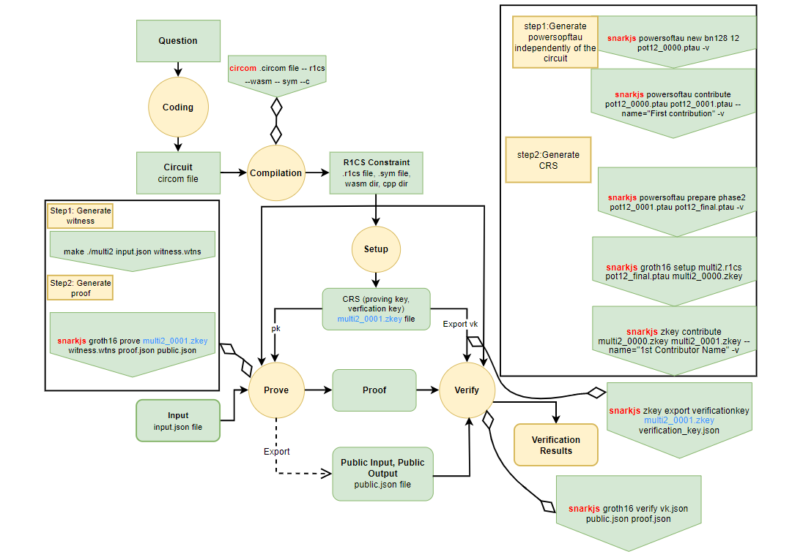

# zkMe-circuits

Usage: Verify user claims in circom.
## zkMe
zkMe verifies user credentials without disclosing any personal information to anyone. Through the use of innovative zero-knowledge technologies, it is the only KYC solution to be fully decentralized, private-by-design and compliant with global AML requirements. No credential verified through the zkMe app is stored on any centralized storage, making it virtual impossible for any private data leak. The only thing shared (if authorized by you) are yes/no answers to basic elegibility questions such as "are you over 18 years old?". [https://zk.me/]

## Identity
An identity can be a person, a company, an organization, a DAO, or a government. When we talk about identity, we mean "identity as an account".

Generally speaking, these accounts are going to be smart contracts. So **you can think of identities as smart contracts**, where the address of the contract is the identifier of that identity.

## Claims
An identity can provide a claim. You can think of a claim as a statement: what an identity is saying.

In most cases, these statements refer to other identities. In other words, **claims usually establish relationships between identities**.

**Claims can be public or private.** And it turns out that almost anything we say or do can be thought of as a claim.

## Zero-knowledge Proofs
In cryptography, a **zero-knowledge proof** or **zero-knowledge protocol** is a method by which one party (the prover) can prove to another party (the verifier) that a given statement is true without revealing any extra information.

## Zk-SNARK
Zk-SNARK is an acronym that stands for "Zero Knowledge Concise Non-Interactive Knowledge Argument". We can think of Zk-SNARK as an efficient way to produce zero-knowledge proofs. 

#####  Five processes of zk-SNARK
1. Convert the problem to a circuit  
2. Compile the circuit into R1CS form. (R1CS is also converted to QAP (Quadratic Arithmetic Programs) format)  
3. Create Trusted Setup to generate CRS, including PK (proof key) and VK (verification key). This process requires the introduction of circuit independent  
This process requires the introduction of circuit-independent random numbers that cannot be compromised and should be destroyed at the end of the setup.  
4. Generate the proof of zk-SNARK  
5. Verify the proof of zk-SNARK  

](https://github.com/zkMeLabs/zkMe-circuits/blob/main/img/zkSNARK_process.png)

## circom
`circom` is a compiler written in Rust for compiling circuits written in the `circom` language.  The compiler outputs the representation of the circuit as constraints and everything needed to compute different Zero-knowledge proofs.

`circomlib` is a `circom` template library containing hundreds of circuits such as comparators, hash functions, digital signatures, binary and decimal converters, and more. You can also create your own custom templates.    

## snarkjs
`snarkjs` is a **JavaScript and Pure Web Assembly implementation of zkSNARK and PLONK schemes**. It is an npm package that contains code to generate and verify Zero-knowledge proofs from artifacts generated by circom.

### circom workflow (based on the zk-SNARK algorithm Groth16)
](https://github.com/zkMeLabs/zkMe-circuits/blob/main/img/circom_process.png)

## Preliminaries
#### Installing dependencies

 1. Rust
To have Rust available in your system, you can install `rustup`. If you're using a Windows system you can download it from https://rustup.rs/. And if you're using Linux or maxOS, open a terminal and enter the following command:
`curl --proto '=https' --tlsv1.2 https://sh.rustup.rs -sSf | sh `

 2. Node.js
To download the latest version of Node, see [here](https://nodejs.org/en/download/).

#### Installing circom
clone the `circom` repository:
`git clone https://github.com/iden3/circom.git`

Enter the circom directory and use the cargo build to compile:
`cargo build --release`

When the command successfully finishes, it generates the `circom` binary in the directory `target/release`. You can install this binary as follows:
`cargo install --path circom`

#### Installing snarkjs
Install `snarkjs` with the following command:

    npm install -g snarkjs

#### package.json
You could find the file package.json in the root directory. If you're using a Windows system please change the line like following:

    "scripts": {
      "clean": "del -fR dist",
      "build": "npm run clean && .\\node_modules\\.bin\\tsc --strictNullChecks"
    }

## Running the demo

Command the following line in the `/circuits` directory.

    ./generate.sh zkMeCredentialQuery

#### Expeceted result
    [INFO]  snarkJS: OK!
Besides, you would see there are two files generated in the `/build/params` directory `proof.json` and `public.json`.

In this demo, we preset a scenario that to verify if the user's age is over 18.
If you want to change to another scenario to fit your needs, you can change the parameter like following.

## input.json
#### issuerClaim
The first three elements are used to set the authentication claims of the users (e.g. user id, user expiry). The fouth one is used to set the user claim you probably want to verify with. 

#### operator
Compare operations:\
    "0" - Noop, skip execution. Ignores all `in` and `value` passed to query, out 1\
    "1" - Equals\
    "2" - Less-than\
    "3" - Greater-than\
    "4" - In\
    "5" - Notin
